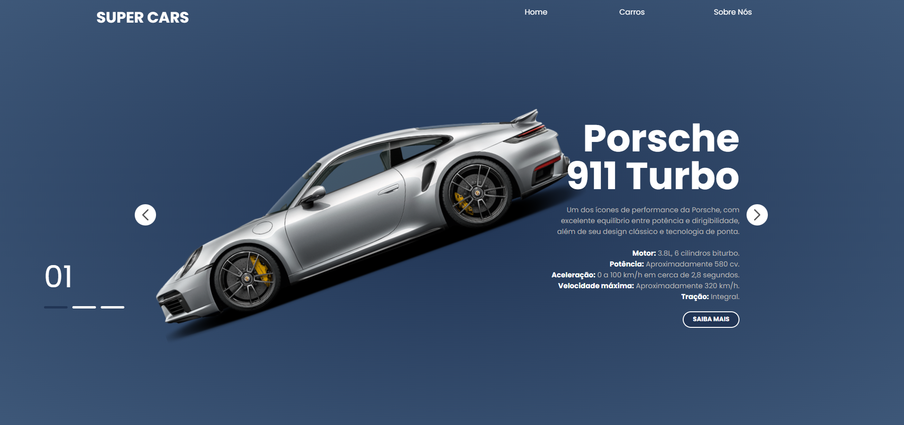

# SUPER CARS

> O projeto SUPER CARS é um site simples e moderno aonde são exibidos super carros e algumas informações sobre os mesmos, com animações dinâmicas nas transições de um carro para outro.

## 🔧 Ajustes e melhorias

O projeto ainda está em desenvolvimento e as próximas atualizações serão voltadas para as seguintes tarefas:

- [ ] Responsividade
- [X] Adição de mais carros

## 🔨 Funcionalidades

- Transicionar para frente e para trás entre os carros disponíveis.

## 💻 Tecnologias

- `HTML`
- `CSS`
- `JavaScript`
- `Git/GitHub`

## 📁 Como utlizar

Para começar você deve baixar o projeto, após isso você poderá abrir o mesmo utilzando o Visual Studio Code. Siga os seguintes passos:

- No canto superior esquerdo clique em **File** > **Open Folder**
- Procure o local onde o projeto está e o selecione (Caso o projeto seja baixado via zip, é necessário extraí-lo antes de procurá-lo)
- Por fim clique em OK

Após a execução dos passos anteriores o projeto pode ser executado via Live Server.
